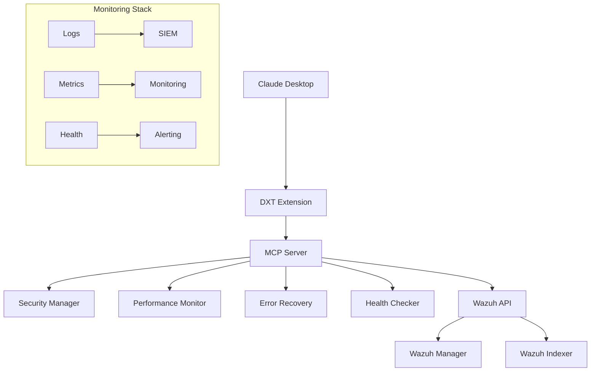

# 🚀 Production Deployment Guide

## Overview

This guide covers deploying the Wazuh MCP Server Desktop Extension (DXT) in production environments with enterprise-grade security, monitoring, and reliability.

## 🏗️ Architecture

### Production Components



## 📋 Pre-Deployment Checklist

### Infrastructure Requirements

- [ ] **Python 3.8+** installed on target systems
- [ ] **Claude Desktop v0.3.0+** deployed to user workstations
- [ ] **Wazuh 4.x** cluster operational with API access
- [ ] **Network connectivity** between workstations and Wazuh infrastructure
- [ ] **SSL certificates** configured (production recommended)

### Security Requirements

- [ ] **API credentials** created with least-privilege access
- [ ] **Network policies** allowing required connections
- [ ] **Audit logging** enabled and configured
- [ ] **Secret management** system for credential distribution
- [ ] **SSL/TLS verification** enabled for all connections

### Monitoring Requirements

- [ ] **Log aggregation** system configured
- [ ] **Metrics collection** infrastructure ready
- [ ] **Alerting** rules defined for critical events
- [ ] **Dashboard** created for operational visibility

## 🔧 Deployment Methods

### Method 1: Enterprise Distribution

For organizations with centralized software management:

```bash
# 1. Build production package
make release

# 2. Sign the package (enterprise)
codesign -s "Developer ID" wazuh-mcp-server-2.0.0.dxt

# 3. Distribute via MDM/Group Policy
# Deploy to %APPDATA%\Claude\extensions\ (Windows)
# Deploy to ~/Library/Application Support/Claude/extensions/ (macOS)
# Deploy to ~/.config/claude/extensions/ (Linux)
```

### Method 2: Self-Service Portal

For organizations with self-service deployment:

```bash
# 1. Host package on internal server
https://internal.company.com/software/wazuh-mcp-server-2.0.0.dxt

# 2. Provide installation instructions
# Users download and install via Claude Desktop UI
```

### Method 3: Automated Deployment

Using configuration management:

```yaml
# Ansible example
- name: Deploy Wazuh MCP DXT
  copy:
    src: wazuh-mcp-server-2.0.0.dxt
    dest: "{{ claude_extensions_dir }}/wazuh-mcp-server.dxt"
  notify: restart claude desktop

- name: Configure extension settings
  template:
    src: wazuh-config.json.j2
    dest: "{{ claude_extensions_dir }}/wazuh-mcp-server/config.json"
```

## ⚙️ Configuration Management

### Environment Variables

**Required Configuration:**
```bash
WAZUH_HOST=wazuh-manager.company.com
WAZUH_PORT=55000
WAZUH_USER=api-user
WAZUH_PASS=secure-api-password
VERIFY_SSL=true
```

**Optional Configuration:**
```bash
# Wazuh Indexer (4.8+)
WAZUH_INDEXER_HOST=wazuh-indexer.company.com
WAZUH_INDEXER_PORT=9200
WAZUH_INDEXER_USER=indexer-user
WAZUH_INDEXER_PASS=indexer-password

# Performance Tuning
MAX_ALERTS_PER_QUERY=1000
REQUEST_TIMEOUT_SECONDS=30
CACHE_TTL_SECONDS=300

# Logging
LOG_LEVEL=INFO
DEBUG=false
```

### Credential Management

**For Enterprise Environments:**

1. **Azure Key Vault Integration:**
```python
# Custom credential provider
from azure.keyvault.secrets import SecretClient
from azure.identity import DefaultAzureCredential

def get_wazuh_credentials():
    client = SecretClient(
        vault_url="https://company-kv.vault.azure.net/",
        credential=DefaultAzureCredential()
    )
    return {
        'username': client.get_secret("wazuh-api-username").value,
        'password': client.get_secret("wazuh-api-password").value
    }
```

2. **HashiCorp Vault Integration:**
```python
import hvac

def get_wazuh_credentials():
    client = hvac.Client(url='https://vault.company.com')
    client.token = os.environ['VAULT_TOKEN']
    
    secret = client.secrets.kv.v2.read_secret_version(
        path='wazuh/api-credentials'
    )
    return secret['data']['data']
```

## 📊 Monitoring and Observability

### Logging Configuration

**Production Logging Setup:**
```python
# Configure structured logging
LOGGING_CONFIG = {
    'log_level': 'INFO',
    'log_dir': '/var/log/wazuh-mcp',
    'enable_structured': True,
    'enable_rotation': True,
    'enable_security_audit': True,
    'enable_performance_logs': True
}
```

**Log Aggregation with ELK Stack:**
```yaml
# filebeat.yml
filebeat.inputs:
- type: log
  paths:
    - /var/log/wazuh-mcp/*.log
  fields:
    service: wazuh-mcp-server
    environment: production
  fields_under_root: true

output.elasticsearch:
  hosts: ["elasticsearch.company.com:9200"]
  index: "wazuh-mcp-%{+yyyy.MM.dd}"
```

### Metrics Collection

**Prometheus Integration:**
```python
# Custom metrics exporter
from prometheus_client import Counter, Histogram, Gauge, start_http_server

# Metrics definitions
api_requests_total = Counter('wazuh_api_requests_total', 'Total API requests')
api_response_time = Histogram('wazuh_api_response_time_seconds', 'API response time')
active_connections = Gauge('wazuh_active_connections', 'Active connections')

# Start metrics server
start_http_server(8000)
```

**Grafana Dashboard Example:**
```json
{
  "dashboard": {
    "title": "Wazuh MCP Server Production",
    "panels": [
      {
        "title": "API Response Time",
        "type": "graph",
        "targets": [
          {
            "expr": "histogram_quantile(0.95, wazuh_api_response_time_seconds)"
          }
        ]
      },
      {
        "title": "Error Rate",
        "type": "singlestat",
        "targets": [
          {
            "expr": "rate(wazuh_api_errors_total[5m])"
          }
        ]
      }
    ]
  }
}
```

### Health Monitoring

**Health Check Endpoint:**
```bash
# Automated health monitoring
curl -f http://localhost:8080/health || alert_ops_team
```

**Nagios/Icinga Integration:**
```bash
#!/bin/bash
# check_wazuh_mcp.sh
result=$(python3 -c "
import asyncio
from src.health_check import run_health_checks

async def main():
    try:
        results = await run_health_checks()
        overall = results['overall_health']
        print(f\"Health: {overall['status']} - {overall['message']}\")
        return 0 if overall['status'] == 'healthy' else 2
    except Exception as e:
        print(f'CRITICAL: {e}')
        return 2

exit(asyncio.run(main()))
")

exit $?
```

## 🔒 Security Considerations

### Network Security

**Firewall Rules:**
```bash
# Allow outbound to Wazuh Manager
iptables -A OUTPUT -p tcp --dport 55000 -d wazuh-manager.company.com -j ACCEPT

# Allow outbound to Wazuh Indexer
iptables -A OUTPUT -p tcp --dport 9200 -d wazuh-indexer.company.com -j ACCEPT

# Block other outbound connections
iptables -A OUTPUT -p tcp --dport 80,443 -j DROP
```

**Certificate Pinning:**
```python
# Pin Wazuh server certificates
CERTIFICATE_PINS = {
    'wazuh-manager.company.com': 'sha256/AAAAAAAAAAAAAAAAAAAAAAAAAAAAAAAAAAAAAAAAAAA=',
    'wazuh-indexer.company.com': 'sha256/BBBBBBBBBBBBBBBBBBBBBBBBBBBBBBBBBBBBBBBBBBB='
}
```

### Data Protection

**Encryption in Transit:**
- All communications use TLS 1.3
- Certificate verification enabled
- Perfect Forward Secrecy required

**Encryption at Rest:**
- Log files encrypted using platform encryption
- Credential storage uses OS keychain
- Temporary files use secure deletion

**Data Retention:**
```python
# Automatic log rotation and cleanup
LOG_RETENTION_POLICIES = {
    'application_logs': '30 days',
    'security_audit_logs': '2 years',
    'performance_logs': '90 days',
    'error_logs': '1 year'
}
```

## 🚨 Incident Response

### Alert Definitions

**Critical Alerts:**
- Authentication failures > 5 per minute
- API response time > 10 seconds
- Memory usage > 90%
- Circuit breaker open state
- Security validation failures

**Warning Alerts:**
- API response time > 5 seconds
- Memory usage > 80%
- Error rate > 1%
- Certificate expiration < 30 days

### Escalation Procedures

```yaml
# PagerDuty integration
alerts:
  - name: "Wazuh MCP Critical"
    condition: "status == 'critical'"
    actions:
      - escalation_policy: "security_team_critical"
      - notification: "slack_security_channel"
  
  - name: "Wazuh MCP Warning"
    condition: "status == 'warning'"
    actions:
      - notification: "email_operations_team"
```

## 🔄 Backup and Recovery

### Configuration Backup

```bash
#!/bin/bash
# backup_wazuh_mcp_config.sh

BACKUP_DIR="/backup/wazuh-mcp/$(date +%Y%m%d)"
mkdir -p "$BACKUP_DIR"

# Backup configuration
cp ~/.config/claude/extensions/wazuh-mcp-server/config.json "$BACKUP_DIR/"

# Backup credentials (encrypted)
gpg --encrypt --recipient ops@company.com \
    ~/.config/claude/extensions/wazuh-mcp-server/credentials \
    > "$BACKUP_DIR/credentials.gpg"

# Backup logs
tar -czf "$BACKUP_DIR/logs.tar.gz" /var/log/wazuh-mcp/
```

### Disaster Recovery

**Recovery Procedures:**

1. **Restore from backup:**
```bash
# Restore configuration
cp $BACKUP_DIR/config.json ~/.config/claude/extensions/wazuh-mcp-server/

# Restore credentials
gpg --decrypt $BACKUP_DIR/credentials.gpg > ~/.config/claude/extensions/wazuh-mcp-server/credentials
```

2. **Verify functionality:**
```bash
# Run health checks
python3 src/health_check.py

# Test API connectivity
curl -f https://wazuh-manager.company.com:55000/
```

3. **Resume operations:**
```bash
# Restart Claude Desktop
systemctl restart claude-desktop  # Linux
# or restart application manually
```

## 📈 Performance Optimization

### Resource Allocation

**Recommended System Resources:**
- **CPU:** 2+ cores
- **Memory:** 4GB+ available
- **Disk:** 10GB+ free space
- **Network:** 10Mbps+ bandwidth

**Performance Tuning:**
```python
# Optimize for production workloads
PERFORMANCE_CONFIG = {
    'max_connections': 20,
    'pool_size': 10,
    'cache_ttl_seconds': 600,
    'request_timeout_seconds': 60,
    'max_alerts_per_query': 2000
}
```

### Caching Strategy

```python
# Redis integration for distributed caching
import redis

cache = redis.Redis(
    host='redis.company.com',
    port=6379,
    password=os.environ['REDIS_PASSWORD'],
    ssl=True
)

# Cache Wazuh API responses
def cache_api_response(key, data, ttl=300):
    cache.setex(key, ttl, json.dumps(data))
```

## 🧪 Testing in Production

### Smoke Tests

```bash
#!/bin/bash
# production_smoke_test.sh

echo "🧪 Running production smoke tests..."

# Test 1: Health check
python3 src/health_check.py || exit 1

# Test 2: API connectivity
curl -f https://wazuh-manager.company.com:55000/ || exit 1

# Test 3: Extension loading
claude-desktop --test-extension wazuh-mcp-server || exit 1

echo "✅ All smoke tests passed"
```

### Load Testing

```python
# load_test.py
import asyncio
import aiohttp
from concurrent.futures import ThreadPoolExecutor

async def load_test():
    """Simulate concurrent users."""
    
    async def simulate_user():
        # Simulate typical user workflow
        await get_alerts()
        await analyze_threats()
        await check_compliance()
    
    # Run 100 concurrent users
    tasks = [simulate_user() for _ in range(100)]
    await asyncio.gather(*tasks)

if __name__ == "__main__":
    asyncio.run(load_test())
```

## 📞 Support and Maintenance

### Support Contacts

- **Level 1:** IT Help Desk (helpdesk@company.com)
- **Level 2:** Security Operations (security-ops@company.com)
- **Level 3:** Development Team (dev-team@company.com)

### Maintenance Windows

- **Regular Updates:** Monthly, 2nd Tuesday, 2-4 AM EST
- **Security Patches:** As needed, with 24-hour notice
- **Major Releases:** Quarterly, with 1-week notice

### Update Procedures

```bash
# Automated update script
#!/bin/bash
# update_wazuh_mcp.sh

# 1. Download new version
wget https://releases.company.com/wazuh-mcp-server-latest.dxt

# 2. Backup current version
cp ~/.config/claude/extensions/wazuh-mcp-server.dxt backup/

# 3. Install new version
claude-desktop --install-extension wazuh-mcp-server-latest.dxt

# 4. Verify installation
python3 src/health_check.py
```

## 🎯 Success Metrics

### Key Performance Indicators

- **Availability:** > 99.9% uptime
- **Response Time:** < 2 seconds average
- **Error Rate:** < 0.1%
- **User Satisfaction:** > 4.5/5 rating

### Monitoring Dashboards

1. **Executive Dashboard:**
   - Overall system health
   - User adoption metrics
   - Security incident summary

2. **Operations Dashboard:**
   - Real-time performance metrics
   - Error rates and trends
   - Resource utilization

3. **Security Dashboard:**
   - Authentication events
   - Security alerts
   - Compliance status

---

## 📋 Quick Reference

### Emergency Commands

```bash
# Restart extension
claude-desktop --restart-extension wazuh-mcp-server

# View logs
tail -f /var/log/wazuh-mcp/wazuh_mcp.log

# Check health
python3 src/health_check.py

# Emergency disable
claude-desktop --disable-extension wazuh-mcp-server
```

### Configuration Files

- **Main Config:** `~/.config/claude/extensions/wazuh-mcp-server/config.json`
- **Logs:** `/var/log/wazuh-mcp/`
- **Credentials:** OS Keychain or environment variables

### API Endpoints

- **Wazuh Manager:** `https://wazuh-manager.company.com:55000/`
- **Wazuh Indexer:** `https://wazuh-indexer.company.com:9200/`
- **Health Check:** `http://localhost:8080/health`

---

**Remember:** This is a production deployment guide. Always follow your organization's security policies and change management procedures.